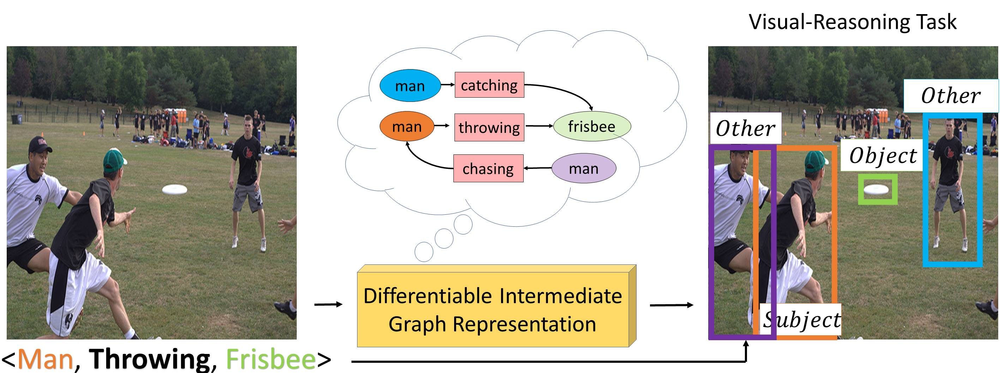
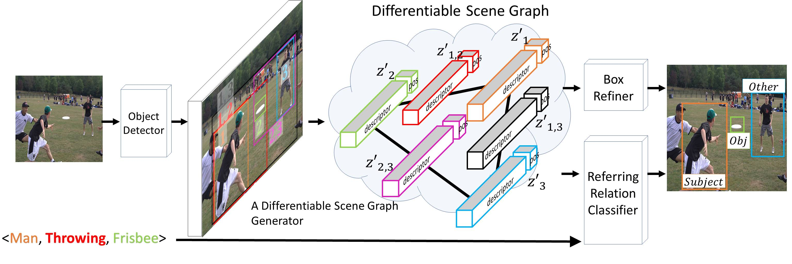

# Differentiable Scene Graphs
####  Moshiko Raboh*, [Roei Herzig*](https://roeiherz.github.io/), [Gal Chechik](https://chechiklab.biu.ac.il/~gal/), [Jonathan Berant](http://www.cs.tau.ac.il/~joberant/), [Amir Globerson](http://www.cs.tau.ac.il/~gamir/)

This repository contains code used to produce the results in our paper.

## Introduction
We propose an intermediate “graph-like” representation (DSGs) that can be learned in an end-to-end manner from the supervision for a downstream visual reasoning task, which achieves a new state-of-the-art results on Referring Relationships[1] task.

### Our novel contributions are:
1. **Differentiable Scene-Graph layer**, which captures the information about multiple entities in an image and their relations. 
2. **A new architecture** for the task of referring relationships, using a DSG as its central component.
3. **New state-of-the art results** on the task of referring relationships on the Visual Genome, VRD and CLEVR datasets.

## Method


The proposed architecture: The input consists of an image and a relationship query triplet <subject, relation, object>. 
1. A detector produces a set of bounding box proposals. 
2. An *RoiAlign* layer extracts object features from the backbone using the boxes. In parallel, every pair of box proposals is used for computing a union box, and  pairwise features  extracted in the same way as object features. 
3. These features are used as inputs to a Differentiable Scene-Graph Generator Module which outputs the Differential Scene Graph, a new and improved set of node and edge features. 
4. The DSG is used for both refining the original box proposals, as well as a Referring Relationships Classifier, which classifies each bounding box proposal as either *Subject*, *Object*, *Other* or *Background*. The ground-truth label of a proposal box will be *Other* if this proposal is involved in another query relationship over this image. Otherwise the ground truth label will be *Background*.

## Model implementation
TBD

## Dependencies
TBD

## Setup

### Compile Cyton
```
cd lib
make clean
make
cd ..
```

### Download image-net weights
```
mkdir -p data/imagenet_weights
cd data/imagenet_weights
wget -v http://download.tensorflow.org/models/resnet_v1_101_2016_08_28.tar.gz
tar -xzvf resnet_v1_101_2016_08_28.tar.gz
mv resnet_v1_101.ckpt res101.ckpt
cd ../..
```
### Download Visual Genome Dataset
```
cd data
wget https://cs.stanford.edu/people/ranjaykrishna/referringrelationships/visualgenome.zip
unzip visualgenome.zip
rm visualgenome.zip
cd VisualGenome
mkdir JPEGImages
cd JPEGImages
wget https://cs.stanford.edu/people/rak248/VG_100K_2/images.zip
unzip images.zip
rm images.zip
wget https://cs.stanford.edu/people/rak248/VG_100K_2/images2.zip
unzip images2.zip
rm images2.zip
cd ../../
```

## Usage
Train a model:
`./experiments/scripts/train.sh <gpu-id> visualgenome res101 <experiment name>`

Test a model:
`./experiments/scripts/train.sh <gpu-id> visualgenome res101 <experiment name>_iter_0`

Test a pre trained model:
`./experiments/scripts/train.sh <gpu-id> visualgenome res101 dsg_pretrained`

## About this repository
This repository implemented on top of "https://github.com/endernewton/tf-faster-rcnn".

## References
[1] Ranjay Krishna, Ines Chami, Michael Bernstein, Li Fei-Fei, [Referring Relationships](https://arxiv.org/abs/1803.10362), CVPR 2018.

## Cite
Please cite our paper if you use this code in your own work:
```
@InProceedings{raboh2020dsg,
  title = {Differentiable Scene Graphs},
  author = {Moshiko Raboh and
            Roei Herzig and
            Gal Chechik and
            Jonathan Berant and
            Amir Globerson},
  booktitle = {Winter Conference on Applications of Computer Vision},
  year = {2020}
}
```
